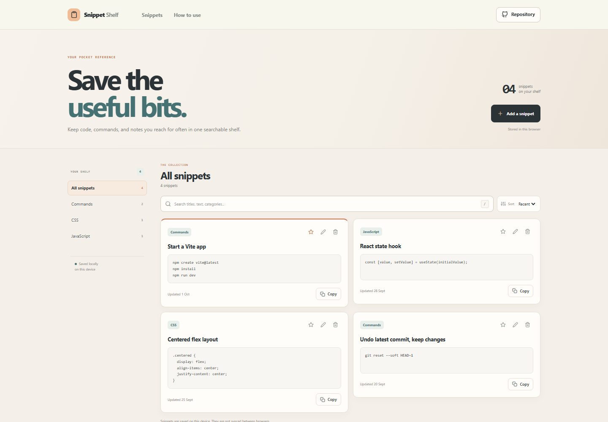



# Clipboard Snippet Library

Snippet Shelf keeps small pieces of text you reuse in one searchable browser library. Save a command, code sample, or note, give it a category, and copy it again when you need it.

**Live app:** [https://a2rp.github.io/clipboard-snippet-library/](https://a2rp.github.io/clipboard-snippet-library/)

## What you can do

- Start with four example snippets, then add your own.
- Search snippet titles, text, and categories as you type.
- Filter by the automatically collected category list and sort by recent update or name.
- Add and edit a title, category, and text in the snippet editor.
- Pin useful snippets so they stay near the top of the recent list.
- Copy an entire snippet with one button.
- Delete an item after reviewing a confirmation that names the snippet.
- Use the responsive library on desktop and mobile.

## Saving and privacy

Snippets are stored in this browser's `localStorage` under `snippet-shelf-v1`. They remain after a page reload on the same browser and device. They are not sent to a server or synchronized to other browsers. Browser storage can be cleared in the browser settings. If storage is blocked, the current page still works and shows a message that changes will not persist after leaving the tab.

Titles are limited to 72 characters, categories to 32 characters, and snippet text to 12,000 characters. Copy actions use the browser clipboard and may need permission.

## Run locally

Requires Node.js and npm.

```sh
npm install
npm run dev
```

Run the tests, check the code with ESLint, and create a production build:

```sh
npm test
npm run lint
npm run build
```

Publish the production build to GitHub Pages with:

```sh
npm run deploy
```

## Future improvements

These are ideas for later versions and are not implemented yet:

- Add import and export for portable library backups.
- Add tags and a keyboard shortcut for opening the new-snippet editor.
- Add optional browser sync across devices.

## Links

- Portfolio: [https://www.ashishranjan.net](https://www.ashishranjan.net)
- GitHub: [https://github.com/a2rp](https://github.com/a2rp)
- CodePen: [https://codepen.io/ash1198](https://codepen.io/ash1198)
- LinkedIn: [https://www.linkedin.com/in/aashishranjan](https://www.linkedin.com/in/aashishranjan)
- Facebook: [https://www.facebook.com/theash.ashish/](https://www.facebook.com/theash.ashish/)
- YouTube: [https://www.youtube.com/@ashishranjan-ashz?sub_confirmation=1](https://www.youtube.com/@ashishranjan-ashz?sub_confirmation=1)
- Email: [mailto:ash.ranjan09@gmail.com](mailto:ash.ranjan09@gmail.com)

## Support

- Support: [https://a2rp-donation-page.netlify.app/](https://a2rp-donation-page.netlify.app/)
- Buy Me a Coffee: [https://buymeacoffee.com/ashishranjan](https://buymeacoffee.com/ashishranjan)
- Patreon: [https://www.patreon.com/ashishranjan](https://www.patreon.com/ashishranjan)
